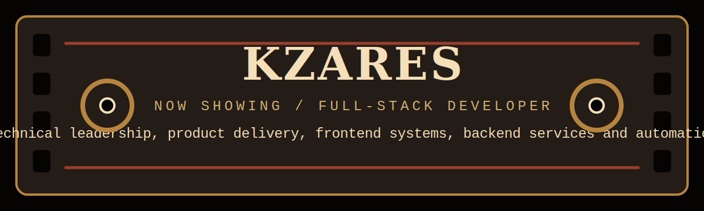
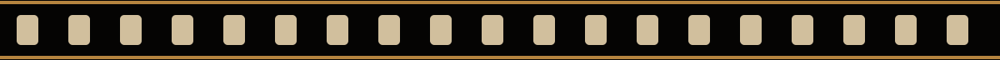

<p align="center">
  
</p>

<p align="center">
  <a href="https://kzares-dev.github.io/">
    
  </a>
  <a href="https://kzares-dev.github.io/kzares-blog/">
    
  </a>
  <a href="https://www.linkedin.com/in/jkzares">
    
  </a>
</p>

<p align="center">
  
  
  
  
  
  
</p>



## Prologue

I am **Jorge Casares**, also building as **Kzares**: a **Full Stack Developer** based in Brazil.

I build web and mobile products with React, Next.js, Astro, React Native, Node.js, NestJS, and TypeScript. I care about clean execution, strong ownership, practical architecture, and shipping software that works.


## Technical Cast

```txt
Languages      JavaScript, TypeScript, Python
Frontend       React, Next.js, Astro, Tailwind CSS, Vite
Mobile         React Native, Expo
Backend        Node.js, NestJS, Express, Flask
APIs           GraphQL, REST, WebSockets
Data           PostgreSQL, MongoDB, Redis
Infra          Docker, Nginx, AWS, GCP, CI/CD
Leadership     System design, technical planning, product delivery, team alignment
```

## Contact

<p>
  <a href="mailto:kzares.dev@gmail.com">
    
  </a>
  <a href="https://github.com/kzares-dev">
    
  </a>
  <a href="https://www.linkedin.com/in/jkzares">
    
  </a>
</p>
